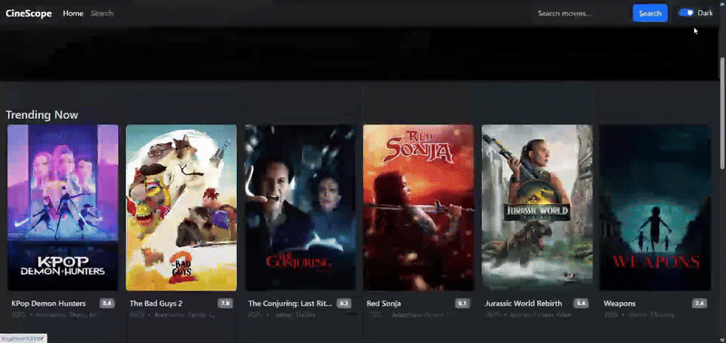

# CineScope — UI-Heavy Movie App (React + Bootstrap + TMDB)

Aplikasi **frontend-only** untuk menunjukkan skill **UI/UX kompleks, animasi, dan interaksi**. Terinspirasi layout ala Netflix: **Hero**, **carousels**, **grid kartu**, **search dengan debounce + infinite scroll**, **detail + trailer**, **dark/light mode**, dan **page transitions** yang halus.

> **Catatan:** Proyek ini hanya frontend. Data diambil dari **TMDB API**.
> This product uses the TMDB API but is not endorsed or certified by TMDB.

---

## ✨ Fitur Utama

* **Home**

  * Hero section dengan backdrop & call-to-action
  * **3 Carousels**: Trending, Top Rated, Now Playing
  * **Skeleton shimmer** saat loading

* **Search**

  * **Debounce** input (fetch otomatis ketika user berhenti mengetik)
  * **Infinite scroll** (auto load halaman berikutnya)
  * Filter **genre** (client-side)
  * Empty state & loading state yang jelas

* **Detail Film**

  * Backdrop + ringkasan, **runtime**, **rating**, **genre**
  * **Trailer modal (YouTube)** jika tersedia
  * **Recommendations** (carousel)

* **UX/Animations**

  * **Dark/Light mode** (persist di `localStorage`)
  * **Page transition** (Framer Motion)
  * **Hover tilt 3D** di kartu film
  * Focus ring aksesibel, lazy-load gambar, dan **prefers-reduced-motion** support

---

## 🧰 Tech Stack

* **React 18**, **React Router 6**
* **Bootstrap 5.3** (`react-bootstrap`)
* **Framer Motion** (animasi)
* **Axios** (HTTP client)
* **TMDB v3 API**

---

## 🚀 Quick Start

1. **Clone** & masuk ke folder proyek
2. **Isi environment** (file `.env` sudah disertakan dengan placeholder):

   ```env
   REACT_APP_TMDB_KEY=YOUR_TMDB_KEY_HERE
   REACT_APP_TMDB_IMG_BASE=https://image.tmdb.org/t/p
   ```
3. **Install & run**

   ```bash
   npm install
   npm start
   ```
4. Buka di browser: `http://localhost:3000`

> **TMDB Key:** daftar gratis di dashboard TMDB, lalu masukkan ke `.env`.
> *Pada repo ini, `.env` memang ikut di-commit tapi hanya berisi **placeholder** (bukan key asli).*

---

## 🧪 Kualitas & Aksesibilitas

* **Skeleton shimmer** custom & **loading placeholders**
* **Focus ring** yang jelas (`:focus-visible`)
* **Reduced motion** support untuk user dengan `prefers-reduced-motion`
* **Lazy load** poster (`loading="lazy"`) & **preconnect** ke `image.tmdb.org`
* **Error/empty states** di Search & Detail

---

## 🙌 Atribusi

* Data & gambar oleh **The Movie Database (TMDB)**
  *This product uses the TMDB API but is not endorsed or certified by TMDB.*

---

## 📷 Preview

Trending

Top Rated

Now Playing

Dark Mode

Details

Search

```
